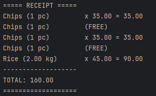

# Grocery Store Checkout Counter Demo (Maven Project)

This is a simple Java program that simulates a **checkout counter** for a store.  
It supports products sold **by piece**, **in bulk**, and with **special promotions** like "Buy One, Get One Free".  
The program calculates totals and prints a receipt for the customer.

---

## Features

- **Piece Products** – Products sold by piece (e.g., a bag of chips for 35 pesos).
- **Bulk Products** – Products sold by weight (e.g., rice at 45 pesos per kg).
- **Promotions** – Supports Buy X Get Y Free promotions.
- **Receipt Printing** – Prints a formatted receipt with all items, free items, and total price.

---

## Project Structure

grocery-store-checkout/

├── pom.xml

├── src/

│   ├── main/java/com/grocery/

│   │   ├── product/        # Product classes

│   │   ├── promotion/      # Promotions

│   │   ├── receipt/        # Receipt printer

│   │   ├── service/        # Checkout counter and cart

│   │   └── Main.java       # Optional demo runner

│   └── test/java/com/grocery/

│       └── CheckoutCounterTest.java

---
## How to Build and Run

### Build the project:

mvn clean compile

### Run the demo:

mvn exec:java

(Make sure you have the exec-maven-plugin configured in pom.xml for this.)

---
## Running Tests

### Run all JUnit 5 tests with:

mvn test

This will execute CheckoutCounterTest.java and show the results in the console.

---

## Sample Output

